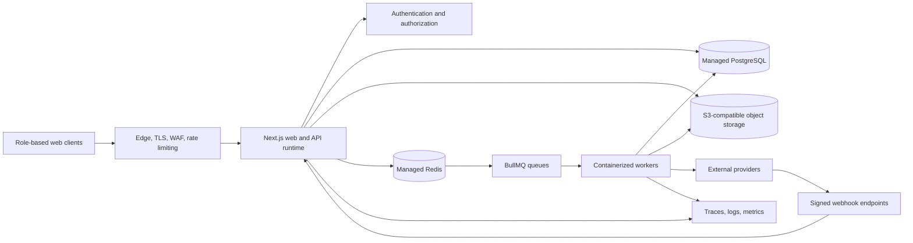

# Élan system and infrastructure design

Status: proposed target architecture grounded in the repository audit of 2026-07-18.

## 1. Design position

Élan should remain a modular monolith for the next stage of the product. The codebase has broad business scope, but most domains still share transactional data and release cadence. Splitting those domains into networked services now would add deployment, consistency, tracing, and incident-response cost without evidence that it removes a measured bottleneck.

The infrastructure should instead create strong logical boundaries inside the application, move slow work to durable queues, make every external provider replaceable, and establish production observability. A domain becomes a separate service only when ownership, scaling, security, or availability requirements make that extraction cheaper than keeping it in the application.

## 2. Repository-backed current state

| Layer | Current implementation | Evidence |
| --- | --- | --- |
| Experience | Next.js 16, React 19, role-specific portals | `app/manager`, `app/sdr`, `app/client`, `app/developer`, `app/bd`, `app/commercial` |
| Access | NextAuth JWT sessions, middleware role gates, granular permissions | `lib/auth.ts`, `middleware.ts`, Prisma permission models |
| Application | Next.js route handlers and domain services | `app/api`, `lib/services`, `lib/email`, `lib/prospects` |
| Data | PostgreSQL through Prisma, 107 business models | `prisma/schema.prisma`, `lib/prisma.ts` |
| Async | BullMQ and Redis for email and prospects | `lib/email/queue`, `lib/prospects/queue` |
| Legacy async | File-based enrichment queue and polling worker | `workers/enrichment.ts`, `private/queue` |
| Storage | Local, S3, MinIO, and Supabase report adapters | `lib/storage` |
| Scheduling | QStash-backed scheduled routes and cron handlers | `app/api/cron`, `@upstash/qstash` |
| Integrations | Gmail, Outlook, SMTP, IMAP, Allo, Apollo, Apify, Explorium, Leexi, Google Drive, Gemini | provider modules under `lib` and integration routes under `app/api` |
| Observability | Vercel Analytics and partial Sentry setup | `app/layout.tsx`, `instrumentation-client.ts`, Sentry config files |

## 3. Target topology

### Deployment units

1. **Web runtime**: the Next.js application on a Vercel-compatible runtime. It serves React, session-aware route handlers, short business transactions, and signed webhooks.
2. **Worker runtime**: a continuously running container service for BullMQ workers. It must not depend on a serverless request staying alive.
3. **Managed PostgreSQL**: the source of truth. Use a transaction pool for ordinary requests and a direct connection only for operations that require session semantics.
4. **Managed Redis**: durable queue coordination, job locks, retry state, deduplication keys, and short-lived rate-limit counters. It does not store canonical business data.
5. **Object storage**: S3-compatible storage for uploads, generated reports, recordings, and attachments. Application databases retain metadata and authorization state.
6. **Observability plane**: centralized error reporting, structured logs, traces, queue metrics, provider metrics, and alert routing.

## 4. Logical system boundaries

The modular monolith should expose six internal domains with explicit public entry points:

- Identity and access: users, sessions, roles, permissions, API keys.
- Revenue operations: clients, missions, campaigns, lists, actions, meetings, opportunities.
- Workforce planning: capacity, allocations, schedules, absences, conflicts.
- Messaging and communications: mailboxes, threads, sequences, templates, comms, notifications.
- Billing and reporting: engagements, invoices, payments, exports, shared reports.
- Platform services: files, storage, tasks, support, AI, integrations, audits.

Domain code can share the same database, but it should not reach into another domain through arbitrary route imports. Cross-domain work should use a public service function for synchronous transactions or a versioned event contract for asynchronous work.

## 5. Request and event flow

### Synchronous request

1. The edge applies TLS, request-size limits, coarse rate limits, and bot protection.
2. Middleware authenticates the session or validates an API key before the request reaches a business handler.
3. The route validates input with a schema, calls a domain service, and performs a bounded database transaction.
4. The response includes a correlation ID. Logs and downstream calls reuse that ID.
5. Any work that may exceed the request latency budget becomes a queue job.

### Asynchronous job

1. The producer writes the business state and an event record in the same transaction where consistency matters.
2. A dispatcher publishes the event to BullMQ using a stable idempotency key.
3. A worker claims the job, records an attempt, and calls the provider through an adapter.
4. Transient failures retry with exponential backoff and jitter.
5. Permanent failures move to a dead-letter queue with a safe replay action.
6. The worker stores the result in PostgreSQL and emits a user notification where needed.

## 6. Key architecture decisions

### ADR 01: modular monolith first

Keep one deployable application while enforcing domain boundaries in code. Extract a service only when at least one trigger is present: independent scaling above 5x the application baseline, strict data isolation, an independent availability target, or a separate owning team.

### ADR 02: PostgreSQL owns business truth

Redis, queues, caches, and search indexes are derived infrastructure. Jobs must be safe to deliver more than once. A queue acknowledgment is not a business commit.

### ADR 03: provider adapters are mandatory

Email, telephony, enrichment, AI, and storage providers must implement internal contracts. Provider-specific payloads stop at the adapter boundary. This keeps switching cost and test scope manageable.

### ADR 04: security is enforced at the boundary

Every session, API key, and webhook is authenticated before business code runs. Authorization is repeated at the domain service for sensitive resources. A header merely being present is never sufficient authentication.

### ADR 05: observability follows a user journey

Every request, job, provider call, and resulting notification shares a correlation ID. Dashboards should answer which user action failed, at what step, after how many attempts, and with which provider response category.

## 7. Priority risks found in the current implementation

### P0: API-key boundary

Middleware currently permits a request to continue when an `x-api-key` header exists and delegates validation to the final route. This is safe only if every protected route validates the key. Move validation into one shared boundary and attach the validated principal and endpoint scope to the request context.

### P0: production telemetry defaults

Server instrumentation is disabled, while client and Sentry configs enable full tracing and default PII. Move DSNs to environment variables, disable default PII, define redaction, enable server instrumentation, and use environment-specific sample rates.

### P1: file-based queue

The enrichment worker polls `private/queue`. Local disk is not a durable coordination layer on serverless or horizontally scaled deployments. Port this job to the existing BullMQ infrastructure and add a dead-letter queue.

### P1: worker deployment contract

Email and prospect BullMQ workers exist in code, but the production process contract should be explicit. Provide one worker entry point, health endpoint, graceful shutdown, concurrency controls, and a deployment definition independent from the web runtime.

### P1: storage configuration

Production must refuse local storage. Normalize AWS environment names, verify bucket encryption and lifecycle rules, restrict MIME and size, scan untrusted files, and keep download URLs short-lived.

### P2: direct database access

The direct Prisma client is appropriate for specific operations, but its use should be narrow and observable. Add transaction timeouts and record pool saturation before increasing connection limits.

## 8. Security model

- Browser sessions: secure, HTTP-only, same-site cookies with an eight-hour maximum lifetime.
- Role control: middleware provides coarse route gating; domain services enforce resource ownership and permissions.
- API keys: hash at rest, show once, rotate, expire, scope by endpoint and action, rate limit by principal.
- Webhooks: verify raw-body signatures, enforce timestamp windows, deduplicate event IDs, store an audit record.
- Secrets: managed secret store only, never hardcoded in client bundles or committed configuration.
- Files: allow-list MIME types, verify magic bytes, scan uploads, store privately, issue short signed URLs.
- PII: redact logs and traces, define data retention by category, log privileged reads and exports.
- Supply chain: lock dependencies, automate vulnerability scanning, and protect production deployment approvals.

## 9. Reliability and recovery targets

These are proposed service objectives and need validation against business expectations:

| Capability | SLO | Recovery target |
| --- | --- | --- |
| Authenticated web and API | 99.9% monthly availability | RTO 60 minutes |
| Core database writes | 99.95% successful valid writes | RPO 5 minutes, RTO 60 minutes |
| Queue processing | 99.5% completed within 15 minutes | Replay from DLQ |
| Email and prospect sync | 99% fresh within 30 minutes | Provider-aware replay |
| File downloads | 99.9% successful signed downloads | Object version recovery |

Backups should include point-in-time PostgreSQL recovery, daily restore verification, object versioning where supported, and quarterly recovery exercises. A backup without a tested restore is not a recovery plan.

## 10. Observability contract

Each log event should include `timestamp`, `environment`, `service`, `route_or_queue`, `correlation_id`, `principal_id_hash`, `client_id`, `mission_id` when applicable, `provider`, `attempt`, `duration_ms`, and `outcome`. Never include message bodies, tokens, credentials, raw phone numbers, or full email addresses.

Minimum dashboards:

- Web: request rate, p50/p95/p99 latency, error rate, slow database calls.
- Database: connection usage, pool wait, transaction duration, deadlocks, storage growth.
- Queues: depth, oldest job age, completion rate, retry rate, DLQ count, worker heartbeat.
- Providers: rate-limit events, timeout rate, circuit state, cost or credit consumption.
- Product journeys: login, prospect import, call enrichment, email send, meeting creation, invoice generation.

## 11. Delivery plan

### Phase 0: inventory and guardrails

- Publish the system map and assign owners to each logical domain.
- Centralize environment validation and document required production secrets.
- Add correlation IDs and structured logging to the request boundary.
- Write architecture tests for forbidden cross-domain imports where practical.

### Phase 1: P0 security and telemetry

- Centralize API-key authentication and endpoint authorization.
- Move Sentry configuration to environment variables, redact PII, and enable server traces.
- Verify webhook signatures and replay protection across all inbound providers.
- Establish the first four alert conditions and incident runbooks.

### Phase 2: durable background work

- Migrate file-based enrichment to BullMQ.
- Create a worker entry point with health, readiness, graceful shutdown, and concurrency configuration.
- Add idempotency keys, exponential retry, provider budgets, and dead-letter queues.
- Deploy workers on a continuously running container platform.

### Phase 3: data and storage recovery

- Enforce managed object storage in production.
- Add file validation, scanning, encryption, lifecycle, and signed download policies.
- Test database point-in-time recovery and document the result.
- Load test database pool and queue throughput with production-like traffic.

### Phase 4: SLO-led evolution

- Review SLOs monthly and allocate error budgets.
- Extract a domain only when measured triggers justify it.
- Prefer read replicas, caching, and worker concurrency tuning before service decomposition.

## 12. Definition of done

The infrastructure design is operational when the developer system page matches the deployed topology, every production process has a health signal and owner, no protected API relies on header presence alone, all long-running work is durable, restore procedures are tested, and one correlation ID can reconstruct a complete user journey across web, queue, provider, and database boundaries.
